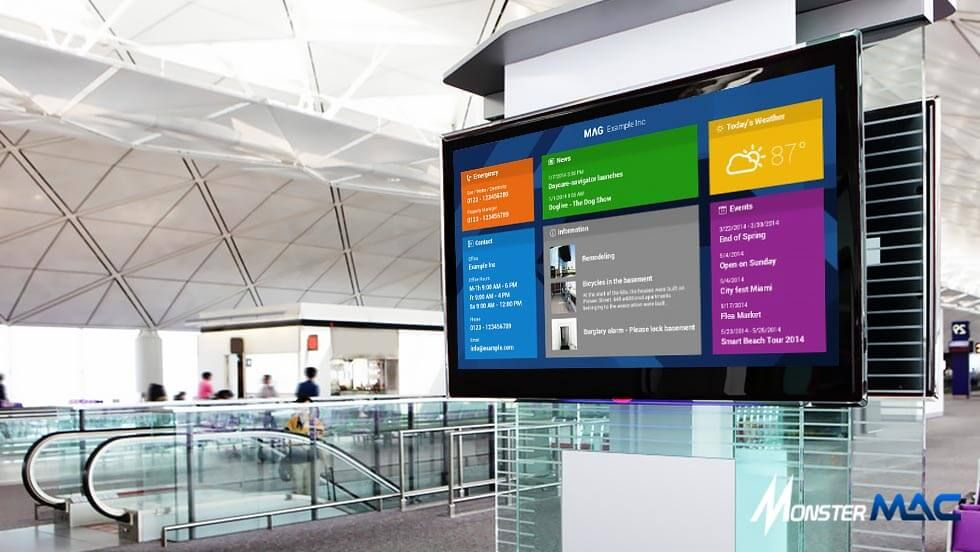

# LUDS

LUDS ( PHP Digital Signage ), um simples Digital Signage com Player Software via navegador: 

Essa é versão da comunidade, um software livre

Veja esta documentação em outros idiomas:
- :us: [English version](../README.md)
- :brazil: [versão em português disponível](README_pt-BR.md). Esta é a documentação principal. Isso se traduz em outros idiomas
- :es: [versão em espanhol disponível](README_es.md), traduzido pelo Google

outros nomes conhecidos
* midía indoor
* midía tv
* tv corporativa
* painéis digitais
* murais digitais 

Veja mais informações sobre: 
* Como funcioa um Digital Signage - https://www.voxeldigital.com.br/blog/como-funciona-publicacao-digital-signage/
* O que é um CMS - https://www.hostinger.com.br/tutoriais/o-que-e-cms

# Requisitos
* PHP 8.0.x ou superior
* [Adianti Fork Template 7.6.0.X ou superior](https://github.com/bjverde/adianti-fork-template/)

# O que tem em cada pasta
* database - script SQL para criar o banco de dados ver arquivo `maindatabase.sql`. Script de permissões extras ver arquivo `permission-inserts-complemento.sql`
* document - documentação com imagens e texto auxiliar.
* system - é o sistema propriamente dito. Com duas partes:  A externa que web player e a interna administrativa que será acessa na URL `/admin`

# Montando aplicação na web

1. Clona o projeto LUDSCE localmente ou no servidor. Pode ser apaenas baixar o zip. Se não sabe clonar ou baixar o arquivo zip, use o tutorial do [Baixando o formDin4](https://github.com/bjverde/formDin/wiki/Baixando-o-formDin) como exemplo e aplique no projeto do LUDSCE.
1. Baixar o [Adianti Fork Temaplate 7.6.0.1](https://github.com/bjverde/adianti-fork-template/releases/tag/v7.6.0.1) copiar o conteúdo do template na pasta `ludsce\system\admin`. *As pastas podem ser mescaladas. Porém NÃO PODE SUBSTITUIR qualquer arquivo*.
1. Instalar o FormDin5 sobre o Adianti Fork Template. O processo é basicamente baixar o zip e descompactar nas pastas corretas por exemplo `LUDSCE/app/lib/widget/FormDin5`, *NÃO precisar alterar qualquer arquivo*. Siga o tutorial de [instalação do FormDin5 sobre o Adianti](https://github.com/bjverde/formDin5#instala%C3%A7%C3%A3o) para ver os detalhes.
1. Vericar com o git, se algum arquivo foi alterado. *Descarta qualquer alteração ou arquivos novos*
1. Ter um servidor PHP 8.0.x ou superior, instalado e configurado com PDO SqLite. Pode ser um servidor local (wamp, lamp etc), Docker, Nuvem, VPS ou Hospedagem. Pode Apache ou Nginx. Se não sabe montar um servidor web php no windows veja o vídeo [Tutorial Instalação do WampServer](https://www.youtube.com/watch?v=fupmd0W1wtE) 
1. No servidor PHP criar a pasta `ludsce`
1. Copiar o conteudo da pasta `system` para a `ludsce` criada no item anterior.
1. Pronto, bastar acessar o sistema
    1. Parte externa que vai passar nas tvs,  http://SERVIDOR/ludsce/
    1. Parte administrativa : http://SERVIDOR/ludsce/admin

usuario | senha | perfil
------ | ------------------ | --------------------
admin | admin | é super usuário pode fazer tudo no sistema. 
user | user | é usuário comum que pode apenas postar conteudo.

# Concorrentes 

| Name             | Site                                                     | GitHub                                    | Description                          |
|------------------|----------------------------------------------------------|-------------------------------------------|--------------------------------------|
| Xibo             | https://xibo.org.uk/                                     |                                           | Most Famous software Digital Display |
| Hikvision Europe | https://www.youtube.com/channel/UCRY0VuF6yFucrTqMfZk6Bng |                                           |                                      |
| smil control     | https://smil-control.com/                                | https://github.com/sagiadinos             |                                      |
| CampusVision     | https://johnsonlm.com/CampusVision/                      | https://github.com/JohnsonLM/CampusVision |  
